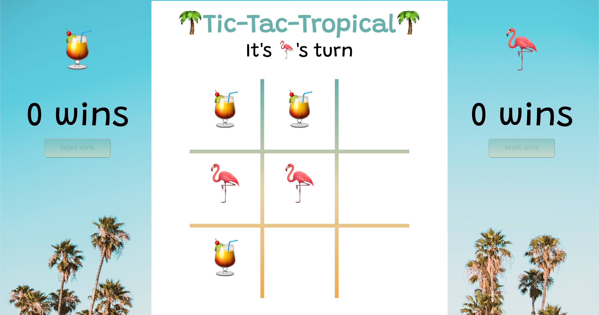

# Tic-Tac-Toe
### Turing School - Mod1 Final Solo Project
_By Kevin Hartmann (2010 Front End)_

## Table of Contents
[Introduction](##A%20Trip%20Down%20Memory%20Lane)
    - [Contributors](###Contributors)
    - [Project Learning Goals](###Project%20Goals)
    - [Project Expectations](###Project%20Expectations)
    - [Technologies Used](###Technologies%20Used)
[Code Architecture & Branch Features](##Code%20Architecture)
    - [HTML](###HTML)
    - [CSS](###CSS)
    - [Javascript](###Javascript)
    - [Branch Features](###Branch20%Features)
[Challenges & Wins](##Challenges20%&20&Wins)
    - [Challenges](###Challenges)
    - [Wins/Reflections](###Wins/Reflections)
[Functionality](##Functionality)
    - [App Layout](###App20%Layout)
    - [Playing The Game](###playing%20the%20game)
    - [Win or Draw](###declaring%20win%20or%20draw)
    - [Continuing to Play](###Continuing%20to%20play)
[Appreciation](##appreciation)

## A Trip Down Memory Lane
  As a child, tic-tac-toe was a game that you could play anywhere or on anything! During long road trips in the car, on a fast food napkin... Or on the chalkboard at school, when the teacher leaves the room. Tic-tac-toe is a classic game for all ages and can become a go to game during spells of boredom.

  What a simple game! To the naked eye (or non-software developer), tic-tac-toe seems simple and easy. Just draw a grid, and fill them with "X's" or "O's".

  During the build out of this project, I found that tic-tac-toe has never been so complicated! Through some hard work, research, and logic tic-tac-toe is now available to you anywhere at anytime. No need for writing utensils anymore!

  I chose to do a Caribbean beach theme as I was inspired by my desire for warmer weather as winter nears, and my brother and I used to play tic-tac-toe in the sand growing up!

### Contributors
  - Kevin Hartmann (solo project)

  - _Reviewer:_ Jeff Duke (mentor)
  - _Project Manager:_ Scott Ertmer (instructor)

### Project Goals
- Solidify and demonstrate the understanding of:
  - DRY Javascript
  - localStorage to persist data
  - event delegation to handle similar event listeners
- Understand the difference between the data model and how data is applied to the DOM
- Iterate through/filter through DOM elements using loops
- Using problem solving skills to break down large problems
  - Using logic to independently solve tic-tac-toe game logic

### Project Expectations
_This project is an important step in demonstrating you are ready to start Module 2. To ensure we can accurately assess that, it’s important you meet the expectations:_

- You are the only one who should type code - no copy-pasting code!
- For any code that you didn’t write entirely by yourself (mentor or rock supported), you should be able delete it and re-write it yourself
- The only resources you use are MDN, CSS Tricks, and lesson plans - no youtube videos or tutorials of programming Tic Tac Toe. If you have an opportunity and are tempted, do the right thing for YOUR learning and don’t do it!
- Any peer-to-peer collaboration should be discussions about IDEAS, not coding together or sharing code.

### Technologies Used
- `Javascript` _for DOM manipulation, and game functionality_
- `HTML` _basic structure of app_
- `CSS` _styling_
- `JSON` _accessing localStorage_
- `Local Storage` _storing user data_
- `git/Github & Github Projects` _workflow and project management_
- `Atom` _text editor_

## Code Architecture

### HTML
I built a basic HTML structure for this project, my goal was to make everything simple and clean... Just like the game of tic-tac-toe. I made sure to use minimal amounts of divs, keep my classes organized, and only use id's when necessary for Javascript.
### CSS
In my CSS you will see that I organized all stylings by section. I applied some general stylings to `HTML` & `Body`, from there I broke each section out by area: `Player-Sidebars` & `Game-Area` (each area is labeled appropriately for better readability). Attempting to keep my CSS "DRY"... I styled elements by classes or tags only, and reduced repetitive styling.
### Javascript
Breaking out my Javascript code into three files, helped with keeping the game functionality and DOM manipulation entirely separate.

_More detail on Javascript Architecture can be found [here.](code-architecture.md)_

### Branch Features
- kevinhartmann23-patch-1: _adding PR Template_
- feature/initial-html: _adding HTML structure_
- feature/iteration1-css-html: _styling basic comp. note: I did name this feature prior to feedback on feature naming_
- feature/iteration3: _Adding base code for `game.js` & `player.js`note: I did name this feature prior to feedback on feature naming_
- feature/check-board-for-draw: _`game.js` method for evaluating a draw_
- feature/checkBorFor-wins: _`game.js` method for evaluating wins_
- feature/recordPlayersTurn-method: _`game.js` method for recording player move and storing its values_
- feature/checking-win/draw-state: _`game.js` method to call both wins and draws_
- feature/populate-board-grid: _`main.js` start to DOM manipulation_
- feature/reset-grid-after-complete: _`main.js` reset game board after win or draws_
- feature/displayWins-dom: _`main.js` display wins on browser_
- feature/disable-moves-after-win: _`main.js` disable game board after a win_
- feature/fix-local-storage: _`main.js` ran into localStorage errors, refactored and made functionable_
- feature/reset-wins-display: _`main.js` ADDED feature, to reset wins on user option_

## Challenges & Wins

### Challenges
- **Game Logic**
  - Taking the time to figure out the game logic, was definitely a puzzle. It was something I enjoyed doing, but took a fair amount of time to apply to that logic to code.
- **Learning to test my code and data model, without DOM**
  - The basic concept of this is something that I was getting the hang of prior to starting this project but applying ways to test my code was proven to be a little more difficult this time around.
  - Hard coding for instant results on code functionality helped, but presented a little more struggle once moving into DOM manipulation.
- **Comparing player moves to win combinations**
  - This was my largest struggle, I spent a lot of time trying to make this method work in the `game.js` file. I found myself researching and pseudocoding 10 different ideas of how I could make this work. I started to mix up and confuse each idea or strategy, causing the time spent on this merthod to take up a lot more time than I had hoped for.
  - When using MDN for prototype array methods, I was more focused on finding an answer and moving on. I didn't fully ready or test out the article I was looking at before trying to code with it. For example, I have used `.indexOf()` a fair amount of times before.. but not to its full potential. Having read the MDN information on it in full before trying to make it work would have led me to a working method much, much sooner.

### Wins/Reflections
- **Completion and additional functionality**
  - At the beginning of this project, I had severe imposter syndrome going on. Being able to work through those thoughts and feeling and provide an end product I am proud of is HUGE for me.
- **Time & Task Management**
  - I used gitHub projects every step of the way. Usually, I build one out but forget to reference it throughout my project. Taking the time to actually keep it updated proved to be super helpful!
  - Setting daily goals helped me organize my time and thoughts, and kept me on track and where I want to be.
- **Planning & PsuedoCoding**
  - This was the first time I really spent a good amount of time planning. It made a huge difference in my thought process and my productivity.

## Functionality

### App Layout
_The first task was to build out and match the provided comp, with my own styling preferences_

### Playing the Game
_The tic-tac-toe board starts empty, and the message displays which users turn it currently is. As the users take turns selecting a space to place their `🍹` or `🦩` the spaces are filled and disabled on the user's click and their correct game token. After a user has taken their turn, the message will change based on which user's turn it is._

_Notice there is a button added... This button is currently disabled, while players are in the middle of their game_

### Declaring a Win or Draw
_After a win occurs the message declaring which users turn it is, is changed to declaring a user win!_

_When a win is declared, the user's win count increases and the game resets. The win count for each user remains on the screen after each game and a page refresh. Notice: The reset button has changed colors and is now clickable!_

### Continuing To Play
_If a user a new user joins on the same browser, the user has the option of resetting the win counts to even the score! Notice: 🍹's wins have reset to `0` but 🦩's have not!_

## Appreciation
I would like to thank my **mentor**, for being a sounding board. He not was there to help me work through my struggles, but did not hand me answers for the sake of learning and growing. Thanks Jeff!

My **instructors**, for teaching me so much in so little time. 6 weeks ago, I couldn't imagine being able to complete a project like this on my own in a few days.

My **cohort**, for being solid people around around and keeping the memes going to lighten up the stress!

Last, but not least, **YOU!** Thank you for checking out my repo!

[Back to Top of Page](#Tic-Tac-Toe)
